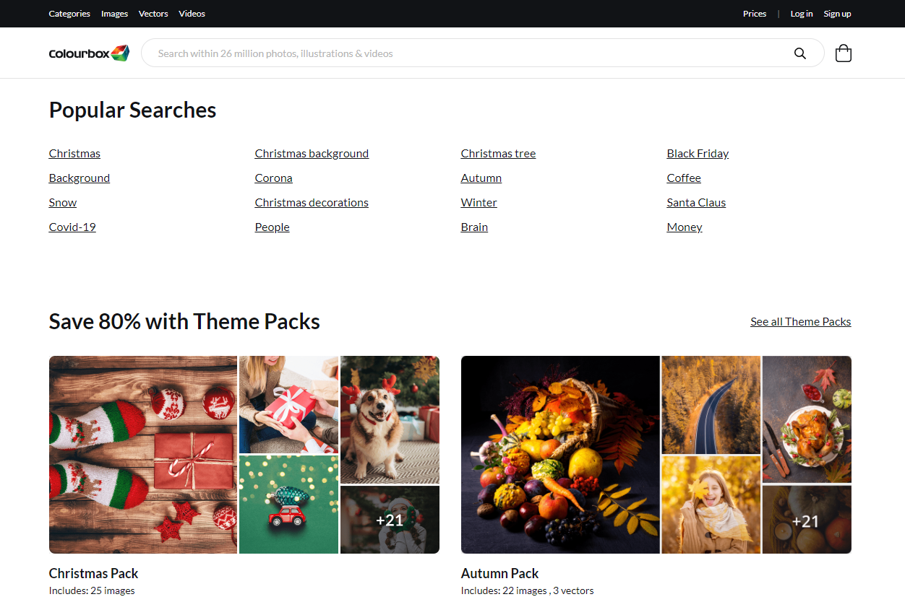
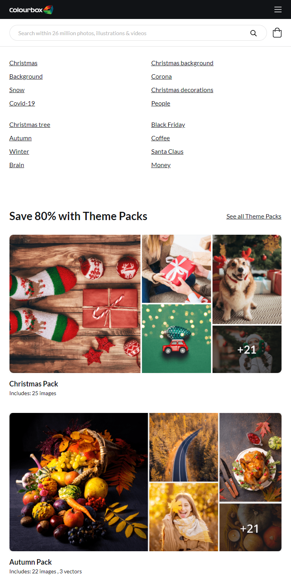

# react-developer-task

Pre-installed:
```React, Webpack, Eslint, Babel, Bootstrap, jQuery, Fontawesome, Google Font Lato```

## TODO

1. Reproduce the design with React/HTML elements. We recommend bootstrap to set up the responsive grid. 
Assests like logo and images can be fetched from ```localhost:9000/assets/*.*```
For icons use FontAwesome. Try to make as pixel perfect as possible.

3. For the custom styling add a css/style generator to this project. We recommend SASS/SCSS or JSS.

4. Make the header (black bar and white bar with logo) ```sticky/fixed``` in all resolutions

5. Generate the list of ```Popular Searches``` by fetching ```localhost:9000/assets/popular-searches.json```

6. Use ES6 syntax. Use React hooks if needed.

## Develop

Follow these commands to start the app on ```localhost:9000```

```nvm use```

```npm install```

```npm start```

## Icons

The design was made with FontAwesome Pro icons, but we would like you to use the free ones.

[Shopping bag](https://fontawesome.com/icons/shopping-bag?style=solid)

[Search](https://fontawesome.com/icons/search?style=solid)

[Bars](https://fontawesome.com/icons/bars?style=solid)

## Design:

Desktop (lg, xl):



Mobile (xs, sm, md):


